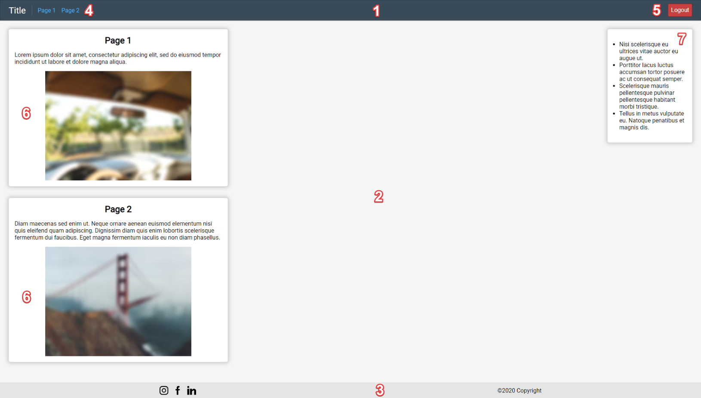

# Project 1. HTML + CSS website

Суть задания - надо исключительно с помощью HTML и CSS сделать страницы, похожие на те, что показаны на видео. Текст, картинки, цвета, количество элементов на страницах на ваше усмотрение, кроме того, что явно будет указано в тексте задания ниже.

**Видео лежит в этой же папке с названием project1_demo.mp4.**

Цифры в скобочках относятся к красно-белым цифрам на скриншоте (чтобы было проще понять, на что я ссылаюсь).
На 3 надо сделать пункты 1-5, на 4 - 6-11, на 5 - все оставшиеся (расположил пункты на 5 по возрастанию сложности).
Сами пункты:

1. Сделать блоки header (1), основную часть (2) и footer (3) и выделить их (например, покрасить их разными цветами), чтобы было видно разделение.
2. Сделать список со ссылками (4), первая из которых выделена другим цветом и ведет на эту же (основную страницу), а остальные ссылки (можете сделать 2 или больше ссылок) - на какие-то другие страницы (контент страниц не важен, но главное, чтобы по нажатию на них происходил переход на другую страницу и надо сохранить header (1) и footer (3)). Подробнее как это выглядит и работает можете на видео посмотреть.
3. В основной части страницы (2) сделать несколько блоков (карточек) с контентом (6). Контентом должен быть заголовок, текст и любая картинка. Картинки и заголовок должны располагаться по центру карточки. Карточки тоже надо как-то выделить.
4. В основной же части контента справа должен быть особый блок - sidebar (7). Он должен быть "прилеплен" к правой части экрана, при этом левая часть экрана должна быть вся занята карточками из предыдущего пункта. Его тоже надо выделить.
5. В footer (3) нужно разместить несколько картинок-ссылок с социальными сетями (ссылки можно оставить пустыми, сами картинки я скину) + какой-то текст правее их.

6. Все это надо реализовать через тот самый display:flex и все свойства, которые с ними связаны.
7. Весь контент на странице не должен быть "сплющен" - на видео заметно, что между каждым элементом на странице (а также между каждым элементом и границами страницы) есть отступы.
8. Надо, чтобы при уменьшении размера страницы (как в конце видео) блоки аккуратно съезжались без возникновения полоски горизонтальной прокрутки до ~300-400 пикселей. Для этого пункта достаточно, чтобы сужались сами блоки контента (карточки), картинки могут оставаться фиксированного размера.
9. В header (1) надо сделать красную кнопку, которая будет прилеплена справа при том, что остальной контент в header прилеплен слева.
10. При наведении на ссылки (4) надо, чтобы они меняли цвет и под ними появлялось подчеркивание, при наведении на кнопку (5) надо, чтобы у нее менялся курсор на палец так же, как и у ссылок и она тоже меняла свой цвет.
11. В карточках (6) на видео заметно, что при уменьшении ширины страницы сначала начинает сужаться блок, а потом и картинки вместе с ним до определенного размера. Надо это повторить.

12. В ссылках (4) можно заметить разделитель между Надписью "Title" и списком страниц. Попробуйте придумать, как его можно реализовать.
13. Можно заметить тени у карточек (6) и header (1). Попробуйте их добавить. Для этого есть специальное свойство в CSS.
14. В footer (3) видно, что картинки-ссылки на социальные сети и текст расположены так, что как между ними, так и между каждым из них и границами страниц есть расстояние и расположены они ровно. Добиться этого можно одним CSS свойством, который работает только с display: flex у контейнера.
15. На видео заметно, что при прокрутке страницы вниз header (1) не пропадает, а всегда остается прилепленным к верху страницы. Добавьте побольше контента на страницу так, чтобы появилась возможность скроллить страницу вверх-вниз и попробуйте прикрепить header к верху так же, как на видео.
16. На видео заметно, что footer (3) прилеплен к низу страницы даже на страницах Page 1 и Page 2, не смотря на то, что в них контент длиной меньше, чем в страницу. Если просто добавить в HTML блок в конец, то он не будет прилеплен к низу. Попробуйте сделать так, чтобы при любом количестве контента footer всегда правильно располагался.
17. Также можно заметить, что шрифты на видео у меня другие. Вместе с картинками я также скинул файл шрифтов. Попробуйте применить их к странице, чтобы у вас были не стандартные шрифты.

Ресурсы, которые надо будет использовать: картинки - для footer, шрифты для 17го пункта. Остальные ресурсы можете выбрать сами

В итоге у вас получится какой-то .html файл с кодом страницы, .css файл со стилями для этого .html кода и папка с моими + вашими ресурсами. Это надо будет загрузить в текущий урок.
